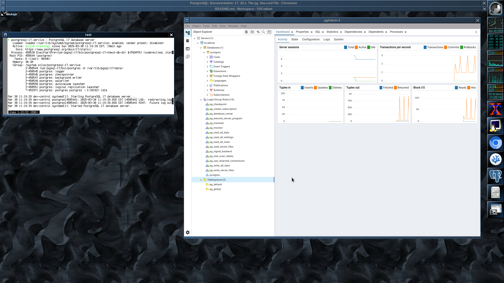

### Install Postgres on Rocky8  
https://www.postgresql.org/download/linux/redhat/#yum  

# Install the repository RPM:

    sudo dnf install -y https://download.postgresql.org/pub/repos/yum/reporpms/EL-8-x86_64/pgdg-redhat-repo-latest.noarch.rpm  

# Disable the built-in PostgreSQL module:  

    sudo dnf -qy module disable postgresql  

# Install PostgreSQL:  

    sudo dnf install -y postgresql17-server  
or    
    sudo dnf install -y postgresql17-server postgresql17-docs postgresql17-plperl postgresql17-odbc

# Initialize the database and enable automatic start:  

    sudo /usr/pgsql-17/bin/postgresql-17-setup initdb  
    sudo systemctl enable postgresql-17  
    sudo systemctl start postgresql-17  

# Status of server
    
    sudo systemctl status postgresql-17
  

### Install pgAdmin from https://www.pgadmin.org/download/pgadmin-4-rpm/  

# First install the repo  
  
    sudo rpm -i https://ftp.postgresql.org/pub/pgadmin/pgadmin4/yum/pgadmin4-redhat-repo-2-1.noarch.rpm  

# Then install the package  
  
    sudo yum install pgadmin4  

# Start pgAdmin 4

    /usr/pgadmin4/bin/pgadmin  

# Done!

